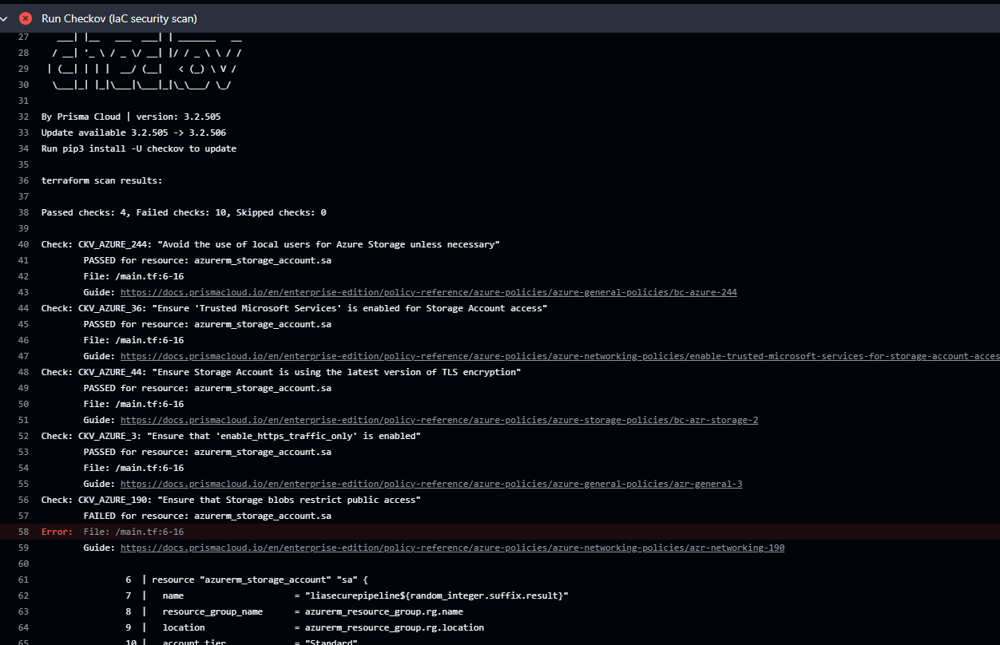
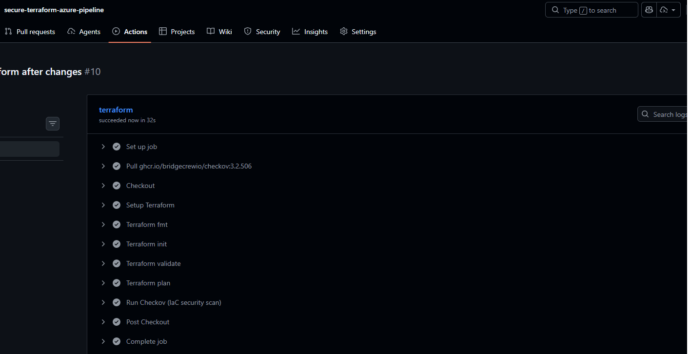
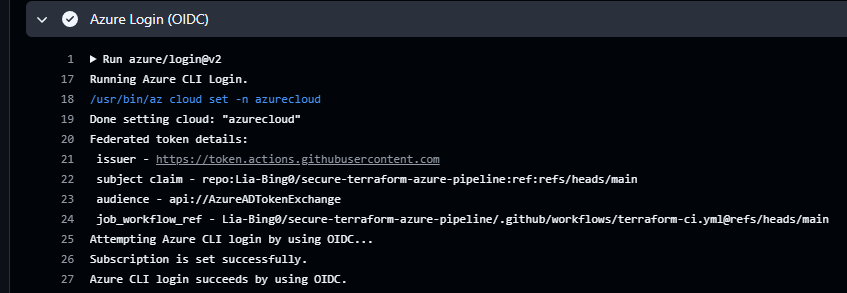
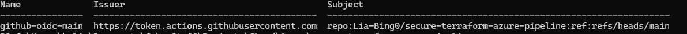
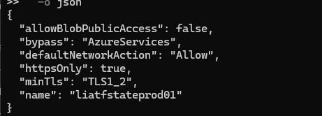

# secure-terraform-azure-pipeline

[](https://github.com/Lia-Bing0/secure-terraform-azure-pipeline/actions/workflows/terraform-ci.yml)

A DevSecOps-focused Terraform + GitHub Actions workflow for Azure that enforces infrastructure quality checks and security policy gates before changes are merged.

This project demonstrates practical cloud security controls by blocking insecure Infrastructure-as-Code (IaC) configurations at CI time.

The repository includes Terraform for infrastructure provisioning, GitHub Actions for pipeline enforcement, and PowerShell bootstrap automation for Entra ID federation and Azure RBAC setup.

## Key Outcomes

- Built a CI pipeline that runs Terraform checks (`fmt`, `init`, `validate`, `plan`) on every push to `main` and on every pull request.
- Integrated Checkov as a security gate to fail builds on misconfigured Azure resources.
- Hardened Azure Storage baseline directly in Terraform (HTTPS-only, TLS 1.2 minimum, no public access, no shared keys).
- Demonstrated fail → remediate → pass workflow to validate security enforcement behavior.
- Implemented GitHub → Azure OIDC federation (no long-lived client secrets).
- Configured Entra ID federated credentials with scoped RBAC.
- Enabled AzureAD authentication for Terraform backend state.

## Architecture

```text
Developer Commit / PR
	|
	v
GitHub Actions: .github/workflows/terraform-ci.yml
	|
	+--> terraform fmt -check -recursive
	+--> terraform init
	+--> terraform validate
	+--> terraform plan
	+--> Checkov scan (policy gate)
		  |
		  +--> PASS: merge/deploy flow can continue
		  +--> FAIL: pipeline blocks insecure change
	|
	v
Azure Resource Group + Hardened Storage Account
```

## CI/CD Pipeline Overview

### Workflow triggers

- `push` to `main`
- `pull_request`

### Pipeline steps

- Terraform formatting enforcement
- Provider initialization
- Configuration validation
- Execution plan preview
- Security scanning with `Checkov`

A failing Checkov check causes the workflow to exit non-zero, enforcing security as a merge gate.

## Security Controls Enforced

- **HTTPS-only + TLS1.2**: `https_traffic_only_enabled = true` and `min_tls_version = "TLS1_2"`.
- **Disallow public/anonymous blob access**: `allow_nested_items_to_be_public = false`.
- **Additional storage hardening implemented**
  - **AzureAD-only authentication**
    - `shared_access_key_enabled = false`
  - **Temporary public network access**
    - `public_network_access_enabled = true`  

	This is a deliberate design tradeoff required for GitHub-hosted runners, which must access the Terraform backend over the public Azure endpoint.

	In production environments this would typically be replaced with a **Private Endpoint + self-hosted runner** to eliminate public network exposure.

- **Geo-redundant replication (GRS)**

Security scanning is automated in CI; insecure configuration changes fail the workflow.

## Demonstration: Fail → Fix → Pass

- **Fail example**: A commit downgrades TLS or enables public blob access, triggering Checkov findings and failing CI.
- **Remediation**: Configuration is hardened to enforce TLS1.2, HTTPS-only traffic, and restricted public access.
- **Result**: Subsequent commit passes all Terraform and security checks.

- 
- 

## Security Enforcement Evidence

### OIDC Authentication (Secretless CI)



### Entra Federated Credential



### Storage Security Configuration



## How to Run Locally

```bash
cd infra

terraform fmt -check -recursive
terraform init
terraform validate
terraform plan
```

Azure authentication options:

- Azure CLI login: `az login`
- Service principal env vars: `ARM_CLIENT_ID`, `ARM_CLIENT_SECRET`, `ARM_TENANT_ID`, `ARM_SUBSCRIPTION_ID`

## GitHub Authentication (OIDC)

This pipeline uses GitHub OIDC federation to authenticate to Azure without client secrets.

### Required GitHub Actions Secrets

- `AZURE_CLIENT_ID`
- `AZURE_TENANT_ID`
- `AZURE_SUBSCRIPTION_ID`

No `ARM_CLIENT_SECRET` is required.

OIDC federation is configured via Entra ID federated credentials and `azure/login@v2`.

### Federated Identity Credential (Trust Boundary)

The file [`federated-credential-main-branch.json`](bootstrap\entra\federated-credential-main-branch.json) defines the workload identity trust relationship between GitHub Actions and Azure (Entra ID).

- **Issuer**: GitHub OIDC provider (`https://token.actions.githubusercontent.com`)
- **Subject**: Restricted to `repo:Lia-Bing0/secure-terraform-azure-pipeline:ref:refs/heads/main`
- **Audience**: `api://AzureADTokenExchange`

This configuration ensures that only workflows triggered from the protected `main` branch of this repository can authenticate to Azure.

Authentication is short-lived and scoped, eliminating static credentials and enforcing branch-level deployment trust.

## Cleanup / Teardown

```bash
cd infra
terraform destroy
```

## Phase 2 – Production Hardening (Completed)

- Remote Terraform state configured in Azure Storage (`liatfstateprod01`)
- State locking enabled via Azure Blob backend
- Bootstrap automation under `/bootstrap` for identity + RBAC setup
- Infrastructure state drift handled using `terraform import`

## Next Phase

- Migrate Terraform backend access to **Azure Private Endpoint**
- Introduce **self-hosted GitHub runner inside the VNet** to eliminate public backend access
- Integrate **Azure Key Vault with customer-managed keys (CMK)**
- Enable **diagnostic settings to Log Analytics / Microsoft Sentinel**
- Add **Azure Policy / Defender for Cloud integration**
  
## Why this matters

- Shifts cloud security left by enforcing controls pre-deployment.
- Prevents misconfiguration drift through automated CI gating.
- Demonstrates secure CI/CD implementation using OIDC federation, least-privilege RBAC, and policy-as-code enforcement aligned with enterprise DevSecOps standards.
