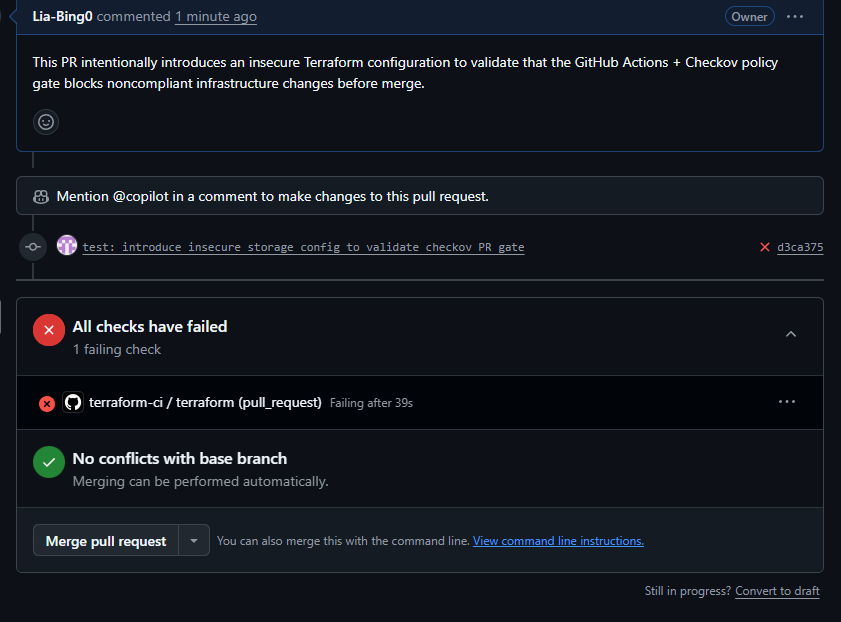
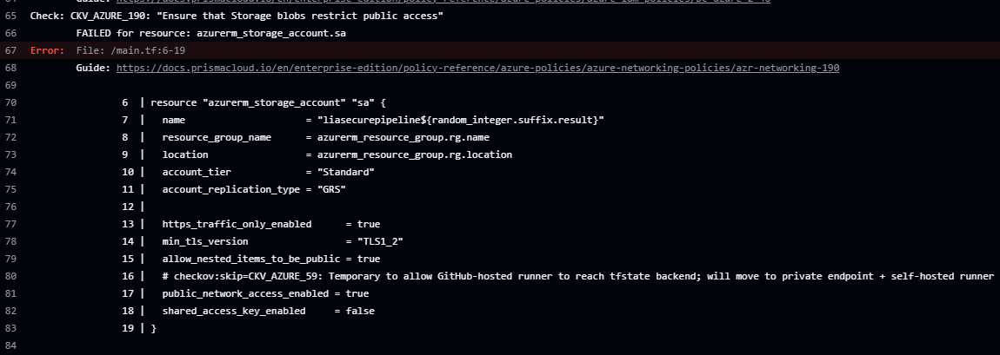
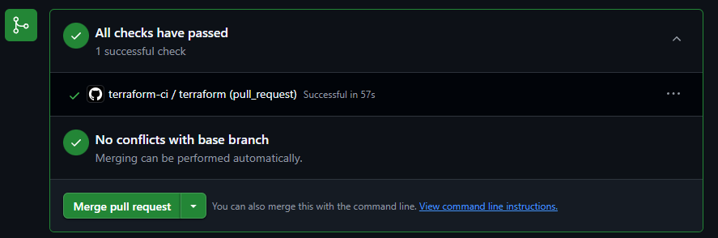
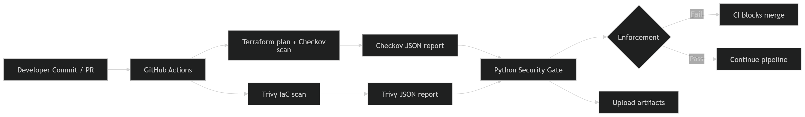
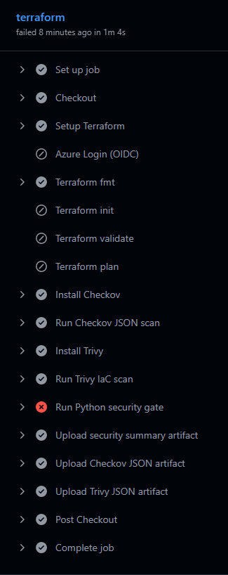
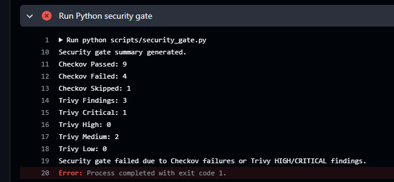
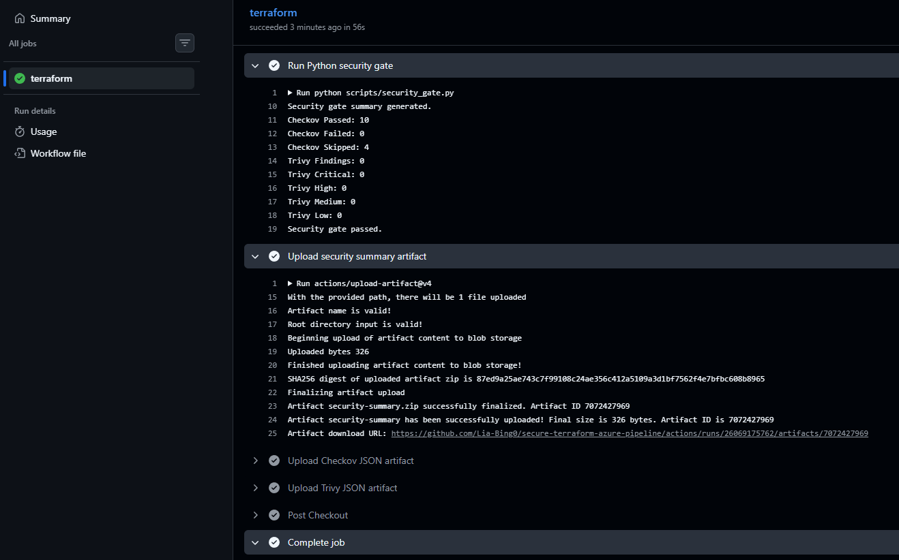

# secure-terraform-azure-pipeline

[](https://github.com/Lia-Bing0/secure-terraform-azure-pipeline/actions/workflows/terraform-ci.yml)

A DevSecOps-focused Terraform + GitHub Actions workflow for Azure that enforces infrastructure quality checks and security policy gates before changes are merged.

This project demonstrates practical cloud security controls by blocking insecure Infrastructure-as-Code (IaC) configurations at CI time.

The repository includes Terraform for infrastructure provisioning, GitHub Actions for pipeline enforcement, and PowerShell bootstrap automation for Entra ID federation and Azure RBAC setup.

The workflow combines Terraform, GitHub Actions, Checkov, Trivy, and a custom Python orchestration layer to enforce severity-aware Infrastructure-as-Code security gates before deployment.

## Key Outcomes

- Built a secretless, least-privilege CI/CD pipeline using GitHub OIDC federation to Azure.
- Implemented multi-tool IaC security enforcement using Checkov, Trivy, and a custom Python orchestration layer.
- Enforced severity-aware CI gating with centralized security summary generation and artifact publishing.
- Hardened Azure Storage configuration with infrastructure encryption, soft delete protection, Azure Monitor diagnostics, and TLS enforcement.
- Demonstrated a remediation-driven DevSecOps workflow from policy failure to clean passing security gate.
- Configured Entra ID federated credentials with scoped RBAC and AzureAD-authenticated Terraform backend access.

## CI/CD Pipeline Overview

### Workflow triggers

- `push` to `main`
- `pull_request`

### Pipeline steps

- Terraform formatting enforcement
- Provider initialization
- Configuration validation
- Execution plan preview
- Security scanning with `Checkov`
- IaC misconfiguration scanning with `Trivy`
- Python-based orchestration layer for normalized reporting and severity-aware CI enforcement
- Artifact publishing for `security-summary.md`, `checkov-report.json`, and `trivy-report.json`

The Python orchestration layer enforces severity-aware CI security gates; failing Checkov checks or Trivy HIGH/CRITICAL findings cause the workflow to exit non-zero and block insecure changes from merging.

## Security Controls Enforced

- **HTTPS-only + TLS1.2**
  - `https_traffic_only_enabled = true`
  - `min_tls_version = "TLS1_2"`

- **Disallow public/anonymous blob access**
  - `allow_nested_items_to_be_public = false`

- **Azure AD-only authentication**
  - `shared_access_key_enabled = false`

- **Temporary public network access (intentional design tradeoff)**
  - `public_network_access_enabled = true`

  This is intentionally enabled to allow GitHub-hosted runners to access the Terraform backend.

  In a production environment, this would be replaced with:
  - Azure Private Endpoint
  - Self-hosted GitHub runner inside the VNet

  This tradeoff is documented and tracked as part of the next hardening phase.

- **Geo-redundant replication (GRS)**

Security scanning is automated in CI; insecure configuration changes fail the workflow.

## Demonstration: Fail → Fix → Pass

### Policy Gate Failure

An intentionally insecure Terraform configuration was introduced in a pull request to validate that the CI pipeline blocks noncompliant Infrastructure-as-Code changes before merge.



### Security Scan Evidence

Checkov detected policy violations related to public blob access in the storage account configuration.



### Remediation

The insecure setting enabling public blob access was corrected.

```hcl
allow_nested_items_to_be_public = false
```



## Security Enforcement Evidence

### OIDC Authentication (Secretless CI)


### Entra Federated Credential


### Storage Security Configuration


## How to Run Locally

```bash
cd infra

terraform fmt -check -recursive
terraform init
terraform validate
terraform plan
```

Azure authentication options:

- Azure CLI login: `az login`
- Service principal env vars: `ARM_CLIENT_ID`, `ARM_CLIENT_SECRET`, `ARM_TENANT_ID`, `ARM_SUBSCRIPTION_ID`

## GitHub Authentication (OIDC)

This pipeline uses GitHub OIDC federation to authenticate to Azure without client secrets.

### Required GitHub Actions Secrets

- `AZURE_CLIENT_ID`
- `AZURE_TENANT_ID`
- `AZURE_SUBSCRIPTION_ID`

No `ARM_CLIENT_SECRET` is required.

OIDC federation is configured via Entra ID federated credentials and `azure/login@v2`.

### Federated Identity Credential (Trust Boundary)

The file [`federated-credential-main-branch.json`](bootstrap/entra/federated-credential-main-branch.json) defines the workload identity trust relationship between GitHub Actions and Azure (Entra ID).

- **Issuer**: GitHub OIDC provider (`https://token.actions.githubusercontent.com`)
- **Subject**: Restricted to `repo:Lia-Bing0/secure-terraform-azure-pipeline:ref:refs/heads/main`
- **Audience**: `api://AzureADTokenExchange`

This configuration ensures that only workflows triggered from the protected `main` branch of this repository can authenticate to Azure.

Authentication is short-lived and scoped, eliminating static credentials and enforcing branch-level deployment trust.

## Cleanup / Teardown

```bash
cd infra
terraform destroy
```

## Phase 2 – Production Hardening (Completed)

- Remote Terraform state configured in Azure Storage (`liatfstateprod01`)
- State locking enabled via Azure Blob backend
- Bootstrap automation under `/bootstrap` for identity + RBAC setup
- Infrastructure state drift handled using `terraform import`

## Next Phase

- Migrate Terraform backend access to **Azure Private Endpoint**
- Introduce **self-hosted GitHub runner inside the VNet** to eliminate public backend access
- Integrate **Azure Key Vault with customer-managed keys (CMK)**
- Enable **diagnostic settings to Log Analytics / Microsoft Sentinel**
- Add **Azure Policy / Defender for Cloud integration**
  
## Python Security Gate

This pipeline integrates automated IaC security scanning with a small Python orchestration layer that parses scanner JSON outputs and enforces severity-aware CI gates.





### Key Features

- **Checkov integration**: policy-as-code scanning for Terraform with machine-readable JSON output.
- **Trivy IaC scanning**: complementary misconfiguration detection with JSON results.
- **Python orchestration layer**: parses both JSON reports, summarizes findings, and applies severity-aware rules.
- **Artifact publishing**: uploads `security-summary.md`, `checkov-report.json`, and `trivy-report.json` to the GitHub Actions run for auditability.

### Pipeline Enforcement Logic

- The Python gate parses the `checkov` and `trivy` JSON outputs produced during the workflow.
- The pipeline fails the CI run if any Checkov policy check is reported as a hard failure.
- The pipeline also fails if Trivy reports findings with severity `HIGH` or `CRITICAL`.
  


- When checks pass, the workflow continues; all JSON reports and a concise `security-summary.md` are uploaded as run artifacts.

### Clean Security Gate Pass



The pipeline now successfully passes:

- Checkov policy enforcement
- Trivy IaC scanning
- Python-based orchestration enforcement

Documented exceptions are intentionally tracked for:

- future private endpoint implementation
- future customer-managed key (CMK) integration

### Why upload JSON reports as artifacts instead of committing them?

- Scanner outputs are generated CI artifacts tied to a specific workflow run.
- Keeping reports out of Git prevents unnecessary repository noise and history growth.
- Artifacts provide run-level traceability while maintaining a clean source-controlled codebase.
- This mirrors how enterprise CI/CD and security pipelines typically manage scan outputs.

## Why this matters

- Shifts cloud security left by enforcing controls pre-deployment.
- Prevents misconfiguration drift through automated CI gating.
- Demonstrates secure CI/CD implementation using OIDC federation, least-privilege RBAC, and policy-as-code enforcement aligned with enterprise DevSecOps standards.
